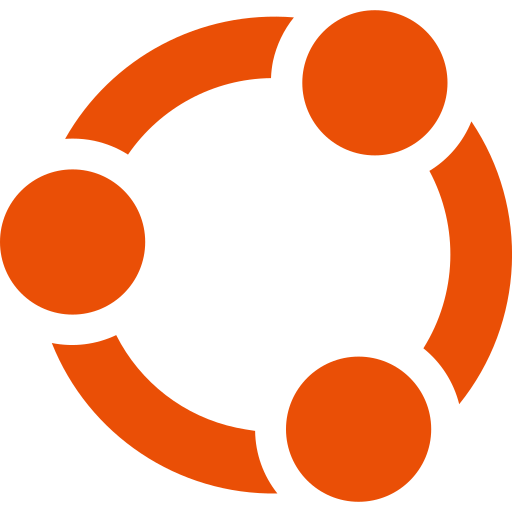
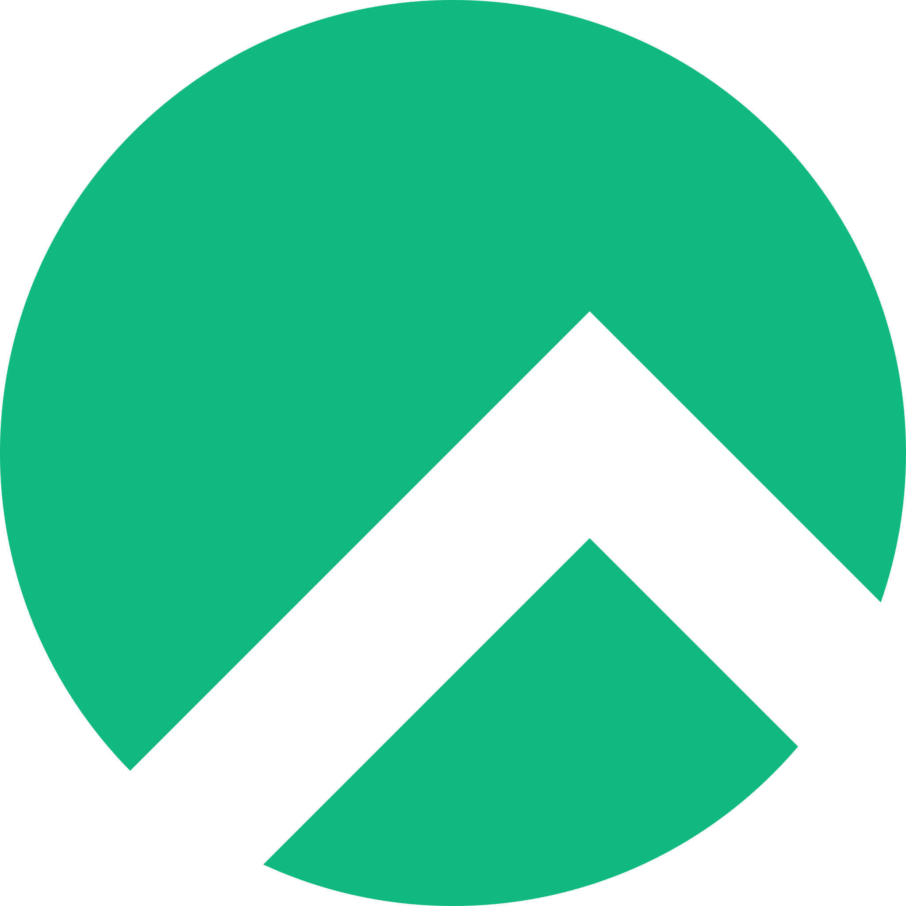
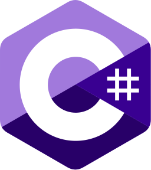
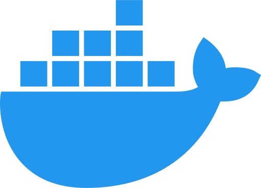
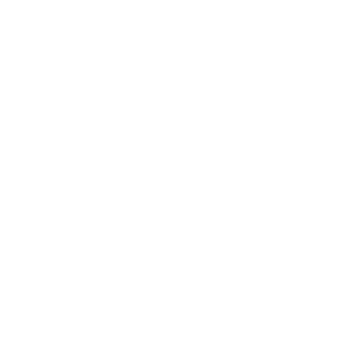
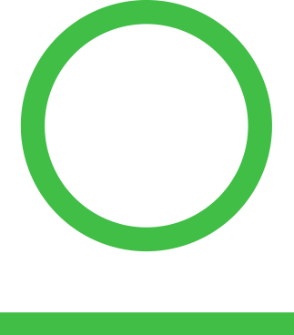
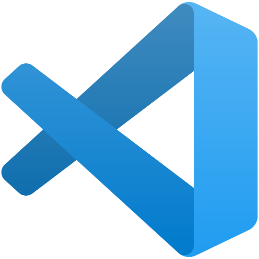

  

Device Driver Engineer @ Intel | C++, Python, Powershell

I build robust device drivers and backend systems, including embedded systems with a passion for software engineering. I have a proven track records using C++, Python, Powershell and Bash in professional setting.

My skills also include Groovy, C#, JavaScript, Go, SQL. I have a strong background in building CI/CD solutions for device drivers, with a specific focus on implementing them on Windows OSes.

I feel confident in my ability to create custom build systems, and to develop data metrics and visualizations from a variety of sources, including CI systems, Basic Automation Tests (BATs), and codebase sources.

   
  🎓 I graduated Math from University of Szczecin
   
  🎓 I have post-graduate studies of West-Pomeranian University of Technology in Embedded Programming
   
  💻In few words: I enjoy learning new things!

<h2 align="center">
  :pencil2: Techs :pencil2:
</h2>

  
  
  

<h2 align="center">
  :pencil2: Techs :pencil2:
</h2>

  
  
  
  
  
  
  
  
  
  
  

<h2 align="center">
  :pencil2 Tools
</h2>

  
  
  
  
  
  
  
  

  
  
  

